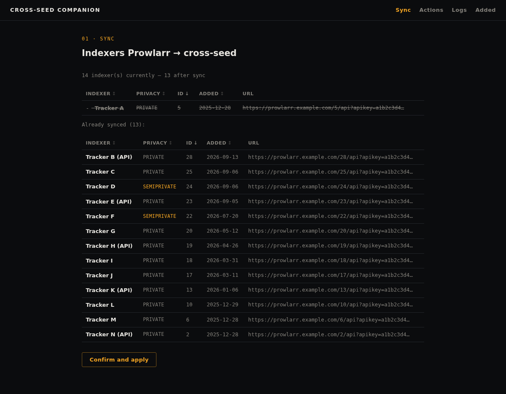
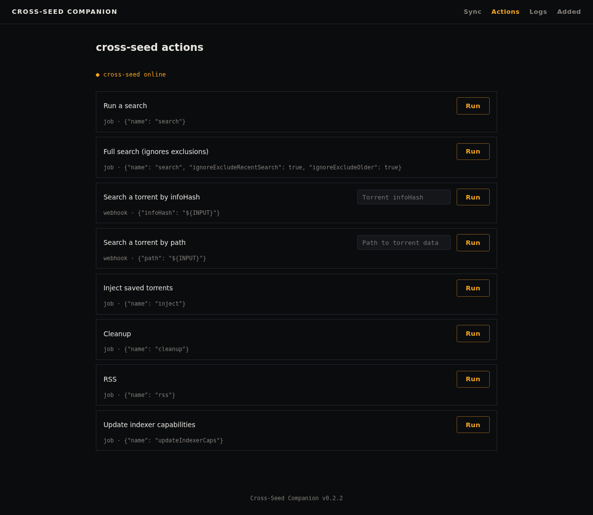
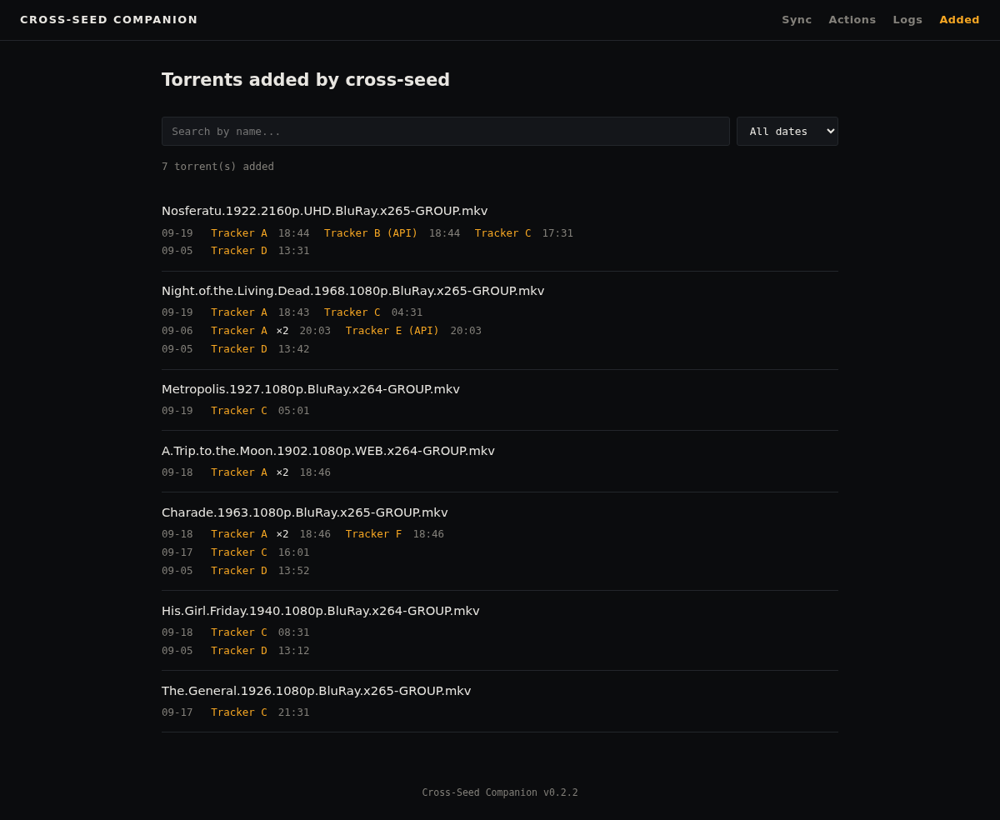
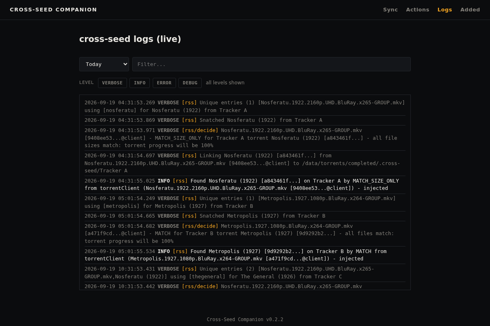

# Cross-Seed Companion (CSC)

[](./LICENSE)
[](https://www.python.org/)
[](./Dockerfile)
[](https://claude.com/claude-code)

A self-hosted web companion for [cross-seed](https://www.cross-seed.org/) — the tool has no UI of its own; CSC gives it one.

> **This project is openly AI-assisted ("vibe coded"), and that's disclosed on purpose.**
> The self-hosted/open-source community is right to be skeptical of AI-generated
> software, especially around security — so the design deliberately avoids anything
> with a large attack surface: **no SSH, no Docker socket access, no shell/subprocess
> execution from user config**, anywhere in the codebase. See [Security](#security)
> and [Architecture](#architecture) below.

## Contents

- [Features](#features)
- [Screenshots](#screenshots)
- [Architecture](#architecture)
- [Quickstart](#quickstart)
- [Versions](#versions)
- [Configuration](#configuration)
- [Security](#security)
- [Contributing](#contributing)
- [License](#license)

## Features

- **Indexer sync** — pulls your enabled indexers from Prowlarr and writes them into
  cross-seed's `torznab` config block, with a diff preview, explicit confirmation,
  and a timestamped backup before any write. Optionally exclude public trackers
  and/or indexers carrying a specific Prowlarr tag.
- **Declarative actions** — trigger cross-seed's API from an `/actions` page: its
  jobs (search, full search, inject, cleanup, RSS, indexer-cap refresh) and a
  search for one specific torrent by infoHash or path (its webhook endpoint),
  with readable messages for the status codes cross-seed documents (job
  disabled, already running), plus a live cross-seed health badge. The API key
  is sent as an `X-Api-Key` header, never in the URL. Extensible via an
  optional custom YAML file (`ACTIONS_CONFIG_PATH`, see
  [`examples/custom-actions.example.yml`](./examples/custom-actions.example.yml))
  using the same schema as the built-in actions — no code changes, and no
  `subprocess`/shell involved: every action is a plain HTTP call with
  whitelist-only variable substitution.
- **Real-time logs** — a `/logs` page streams cross-seed's `verbose.current.log`
  live over Server-Sent Events, with a short backfill on load, a client-side
  text filter, and level toggles (INFO/ERROR/...). A day picker lets you
  switch to any already-rotated log file instead of the live current day.
- **Added torrents** — a `/added` page lists what cross-seed has actually
  added to your torrent client, one row per torrent, parsed from every
  available `verbose.*.log` file — no qBittorrent connection needed. For each
  injection cross-seed logs the torrent it created and the torrent it was made
  from; CSC follows those links, so all the copies of the same torrent are
  grouped in one row (even when they are named differently on each tracker, or
  were added on different days), with one entry per injection: tracker and
  date. A row of counters on top shows the cross-seeds added in total, today,
  over the last 7 days and this month, plus the top trackers. Only lines cross-seed itself marks as a genuine success (`injected`,
  or `saved` in its save-only mode) count, for every match type (`MATCH`,
  `MATCH_SIZE_ONLY`); injection failures and "already exists" lines are
  excluded. Limits: history stops at the oldest log file you keep, a torrent
  you removed from your client afterwards still appears, and timestamps follow
  the timezone of the cross-seed container (set `TZ` there for local time).
  Parsed results are cached in memory per log file, so only the current day's
  log is re-read as it grows; the first load after a restart reads every
  available file.

## Screenshots

Sample data (indexer, tracker and release names, URLs and keys are placeholders).

| Sync | Actions |
|---|---|
|  |  |

| Added torrents | Live logs |
|---|---|
|  |  |

## Architecture

CSC is a single Python (FastAPI + htmx) Docker image, server-rendered, no
build step, no Node.js in the image. It's designed to run on the **same
Docker host as cross-seed**, reading and writing cross-seed's config through a
bind mount — never over SSH, never through the Docker socket:

- cross-seed's `config.js` is mounted read-write (needed for the sync feature).
- cross-seed's `logs/` directory is mounted read-only (used by the live log
  viewer and the added-torrents list).
- cross-seed's internal SQLite database (`cross-seed.db`) is never touched —
  its schema isn't a stable public contract, unlike the logs and config file.

CSC never restarts cross-seed itself (there's no reliable, sensitive-mechanism-free
way to do that). After a sync, it shows a manual-restart reminder and, if you set
`DOCKER_MANAGER_URL`, a direct link to your own Docker management UI (Portainer,
Dockge, etc.).

## Quickstart

Prerequisites: a running [cross-seed](https://www.cross-seed.org/) on the
same Docker host, and [Prowlarr](https://prowlarr.com/) reachable over HTTP.

```bash
curl -O https://raw.githubusercontent.com/exoenjoi/cross-seed-companion/main/docker-compose.example.yml
mv docker-compose.example.yml docker-compose.yml
# edit docker-compose.yml: API keys, URLs, and the volume pointing at your
# real cross-seed config directory (the one containing config.js and logs/)

docker compose up -d
```

The image is built by GitHub Actions on every push to `main` and published to
`ghcr.io/exoenjoi/cross-seed-companion`. To update: `docker compose pull && docker compose up -d`.

Then open `http://<host>:8000/sync` — review the diff, confirm, restart cross-seed.

## Versions

Releases follow [semantic versioning](https://semver.org/) (`MAJOR.MINOR.PATCH`).
While the major version is `0`, minor releases may change configuration
(environment variables, the actions YAML schema, action ids): check the
[release notes](https://github.com/exoenjoi/cross-seed-companion/releases) before upgrading.

| Image tag | What it is |
|---|---|
| `latest` | The most recent release |
| `0.1.0` | That exact release (pin this for reproducible deployments) |
| `0.1` | The latest patch of that minor version |
| `edge` | The current `main` branch, may be unreleased or unstable |

The running version is shown in the footer of every page.

## Configuration

Everything is configured through environment variables.

| Variable | Required | Purpose |
|---|---|---|
| `PROWLARR_URL` | yes | Prowlarr's base URL |
| `PROWLARR_API_KEY` | yes | Prowlarr API key |
| `CROSSSEED_URL` | yes | cross-seed daemon's base URL (used by the declarative actions feature) |
| `CROSSSEED_API_KEY` | yes | cross-seed API key (used by the declarative actions feature) |
| `CROSSSEED_CONFIG_PATH` | yes | Path (bind mount) to cross-seed's config directory |
| `SYNC_EXCLUDE_PUBLIC` | no | Exclude public-tracker indexers from the sync (default: `false`) |
| `SYNC_EXCLUDE_TAG` | no | Name of a Prowlarr tag; indexers carrying it are excluded from the sync |
| `DOCKER_MANAGER_URL` | no | Link shown after a sync to your Docker management tool |
| `ACTIONS_CONFIG_PATH` | no | Path to an optional custom actions YAML file (see `examples/custom-actions.example.yml`) |
| `CROSSSEED_LOGS_PATH` | no | Path to cross-seed's `logs/` directory, if mounted separately (defaults to `CROSSSEED_CONFIG_PATH/logs`) |
| `PUID` / `PGID` | no | UID/GID the container runs as (default: `1000`/`1000`, never root). Set these to whatever owns your cross-seed config directory on the host (`id -u`/`id -g`), or writes to it (backups, sync) will fail with `Permission denied` |

## Security

CSC has **no authentication and no CSRF protection built in, and none is
planned** — that's deliberately out of scope; a reverse-proxy auth layer
already does this well, and reimplementing it here would just be another
attack surface. `POST /sync/apply` rewrites a real file on disk, and the
diff view shows the first 8 characters of each indexer's API key. **Never expose this
port directly to the internet** — put it behind an authenticating reverse
proxy (e.g. [Authentik](https://goauthentik.io/), [Authelia](https://www.authelia.com/),
or your proxy's own basic auth), or restrict it to a private network/VPN.

CSC's own hard design constraints (not just this feature's, the whole
project's): no SSH, no Docker socket access, no shell/subprocess execution
driven by user-supplied configuration.

## Contributing

- Tests run with `pytest -v` (install `requirements-dev.txt`).
- Any behavior change needs a test.
- Open an issue before a significant feature change, to discuss the approach
  first — see [`CONTRIBUTING.md`](./CONTRIBUTING.md).

This project's specs, implementation plans, and design-process artifacts were
produced with [Claude Code](https://claude.com/claude-code) and intentionally
kept out of version control (`.gitignore`) — they're development scaffolding,
not part of the shipped app.

## License

MIT — see [`LICENSE`](./LICENSE).
